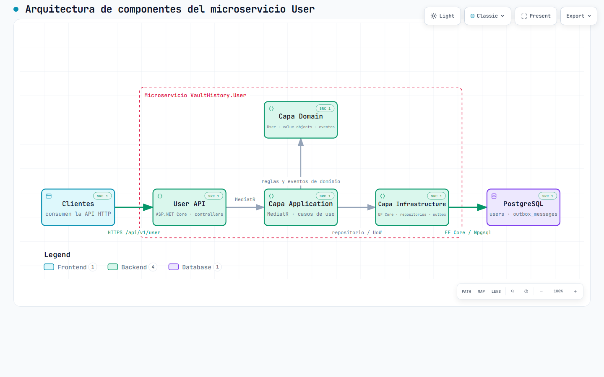

# VaultHistory.Microservice.User

`VaultHistory.Microservice.User` is the .NET 10 account service for Vault History. It owns account registration, sign-in, profile updates, password changes, account deactivation, and user-facing preferences. It also records domain events in a transactional outbox so downstream services can process relevant changes without coupling to an HTTP request.

## Architecture



The User API receives HTTP requests, delegates commands and queries through the Application layer, and keeps business rules in the Domain layer. Infrastructure implements persistence with Entity Framework Core and PostgreSQL. The service owns the `users` and `outbox_messages` schema and applies its EF Core migrations at startup; Jobs reads the shared outbox through Prisma and does not run those migrations. The same migration history also contains the Notification `notification_checkpoints` schema changes.

- [Interactive component architecture](docs/architecture/user-componentes.html)
- [Component architecture source](docs/architecture/user-componentes.json)
- [Interactive sign-in and outbox sequence](docs/architecture/signin-secuencia.html)
- [Sign-in sequence source](docs/architecture/signin-secuencia.json)
- [Previous interactive architecture diagram](docs/architecture/user-architecture.html) and its [source](docs/architecture/user-architecture.json)

### Layers and sign-in flow

- **API** exposes versioned ASP.NET Core controllers, Swagger outside Production, health checks, exception handling, and the custom JWT authorization filter.
- **Application** coordinates MediatR commands, queries, validation, JWT creation, and password hashing.
- **Domain** contains the `User` aggregate, value objects, domain events, repository contracts, and the unit-of-work abstraction without an Infrastructure dependency.
- **Infrastructure** provides EF Core mappings, `ApplicationDbContext`, repositories, PostgreSQL configuration, migrations, and outbox serialization.

For a successful sign-in, the service verifies the stored password hash, records `UserSignedInEvent`, and calls `SaveChangesAsync` before it creates the JWT. `ApplicationDbContext` converts domain events into `PENDING` records in `outbox_messages` as part of that save. If this persistence step fails, the service returns `User.SigninPersistenceFailed` and does not issue a token. The sign-in payload stored for Jobs contains the user identifier, never the password or JWT.

## API capabilities

The controller route is `api/v{version}/User`; the current version is `v1`. `signup` and `signin` are anonymous. All other endpoints require an `Authorization: Bearer <JWT>` header.

| Method and route | Responsibility |
| --- | --- |
| `POST /api/v1/User/signup` | Create an account with name, email, password, optional birth date, notification preference, theme, and character; returns a JWT and expiration. |
| `POST /api/v1/User/signin` | Validate credentials, persist the sign-in outbox event, and return a JWT and expiration. |
| `GET /api/v1/User` | Return the authenticated user's profile. |
| `GET /api/v1/User/by-email?email=...` | Return a user by email for an authorized requester. |
| `PUT /api/v1/User` | Update name, birth date, notification preference, theme, or character for the authenticated user. |
| `POST /api/v1/User/change-password` | Change the authenticated user's password. |
| `DELETE /api/v1/User` | Deactivate the authenticated user. |

Responses expose profile data and preference values, but never password hashes, salts, or JWT signing keys. Swagger documents the request and response models when the API runs outside Production.

## Technology and project layout

- .NET 10 and ASP.NET Core Web API
- MediatR and FluentValidation
- Entity Framework Core with PostgreSQL and Npgsql
- Argon2id password hashing and HMAC-SHA256 JWTs
- Swagger / OpenAPI, xUnit, and Testcontainers

```text
src/
  VaultHistory.User.Api/             HTTP host, controllers, security, middleware
  VaultHistory.User.Application/     use cases, validation, providers, DTOs
  VaultHistory.User.Domain/          aggregate, value objects, events, contracts
  VaultHistory.User.Infrastructure/  EF Core, repositories, outbox, migrations

tests/
  VaultHistory.User.Api.UnitTests/
  VaultHistory.User.Api.IntegrationTests/
  VaultHistory.User.Application.UnitTests/
  VaultHistory.User.Domain.UnitTests/
  VaultHistory.User.Infrastructure.IntegrationTests/
  VaultHistory.User.Infrastructure.UnitTests/
```

## Prerequisites and configuration

Install the .NET 10 SDK. Docker Desktop is required for the integration tests that start PostgreSQL through Testcontainers, and for the shared local environment.

Configuration is loaded in this order:

1. `src/VaultHistory.User.Api/Configurations/appsettings.json`
2. `src/VaultHistory.User.Api/Configurations/appsettings.{Environment}.json`
3. Environment variables

For local development, use `ASPNETCORE_ENVIRONMENT=Local`. The checked-in Local configuration is a development example; replace the connection string and JWT settings with environment-specific values and do not commit real credentials. A Dockerized API must use the PostgreSQL service hostname rather than `localhost`.

```json
{
  "ConnectionStrings": {
    "DefaultConnection": "Host=localhost;Port=5432;Database=app_db;Username=<user>;Password=<password>"
  },
  "Jwt": {
    "PrivateKey": "<long-development-key>",
    "Issuer": "VaultHistory.User.Api",
    "Audience": "VaultHistory.User.Clients",
    "ExpirationMinutes": 30
  }
}
```

## Run locally and with Docker

Restore, build, and run the API from this repository:

```bash
dotnet restore
dotnet build
dotnet watch run --project src/VaultHistory.User.Api
```

The `http` launch profile uses `http://localhost:5000`; the health endpoint is `GET /health`.

The system Dockerfile, Compose topology, and shared PostgreSQL environment are maintained in [Vault.History.System](https://github.com/CarlosSV923/Vault.History.System). From that repository and its local sibling service checkouts, start the complete environment with:

```bash
docker compose up --build -d
```

Do not create a separate Compose definition here. When User's persistent model changes, verify the shared environment after applying the migration.

### EF Core migrations

Migrations are stored in `src/VaultHistory.User.Infrastructure/Database/Migrations`. Create and apply them with the API as the startup project:

```bash
dotnet ef migrations add <MigrationName> \
  --project src/VaultHistory.User.Infrastructure \
  --startup-project src/VaultHistory.User.Api \
  --output-dir Database/Migrations

dotnet ef database update \
  --project src/VaultHistory.User.Infrastructure \
  --startup-project src/VaultHistory.User.Api
```

## Testing

Run the full suite with:

```bash
dotnet test
```

To run one project, for example:

```bash
dotnet test tests/VaultHistory.User.Domain.UnitTests
```

API and Infrastructure integration tests use PostgreSQL through Testcontainers, so Docker must be running. Unit tests do not require a database container.

## Authentication limits and related repositories

JWTs expire after the configured lifetime (30 minutes in the Local example). The current API has no refresh-token, logout, or server-side token-revocation endpoint; clients must handle expiry by signing in again. This is a documented limitation, not a promised future capability. For system-level deferred work and the Docker environment, see [Vault.History.System](https://github.com/CarlosSV923/Vault.History.System).

Related services:

- [Vault History System](https://github.com/CarlosSV923/Vault.History.System) — shared local orchestration and system documentation
- [VaultHistory.Microservice.Jobs](https://github.com/CarlosSV923/VaultHistory.Microservice.Jobs) — reads the shared outbox and publishes background work
- [VaultHistory.Microservice.Notification](https://github.com/CarlosSV923/VaultHistory.Microservice.Notification) — processes notification outcomes and checkpoints
- [VaultHistory.Microservice.History](https://github.com/CarlosSV923/VaultHistory.Microservice.History) — history generation and retrieval
